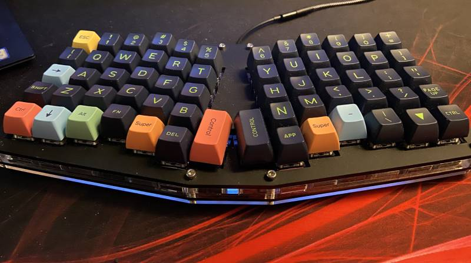

# qmk-atreus62
This is my custom firmware for my Atreus62 keyboard.

If you're interested in getting yourself an Atreus62 keyboards, it can be purchased from [Profet Keyboards](https://shop.profetkeyboards.com/product/atreus62-keyboard). It can be purchased pre-assembled or with parts so you can assamble it your own.

## About

This is my custom layout which is based on the US keyboard layout with some extra modifications for the Swedish characters `åäö`. It consists of two layers where some special keys are accessible while holding the `FN` key. 

Input of Swedish characters under US layout is achieved with the unicode input mode that is available in Linux via (the `ctrl` + `shift` + `u`) key combination. You can read more about this at the [QMKs Unicode section](https://beta.docs.qmk.fm/using-qmk/software-features/feature_unicode#input-modes).

_This mode is not accesible under Windows, and therefore this layout might not work as expected for those users._

Some applications behave unexpectedly when trying to input characters this way, resulting in some weird behaviour. To circumvent this, one workaround is to temporarily change the keyboard layout to Swedish in your OS. 

## Installation

Putting this layout on your keyboard consists of two steps, compiling and flashing. In order to do these we first need to get the [QMK Firmware](https://github.com/qmk/qmk_firmware). It can easily be installed via the following command.

```
make qmk
```

After installing QMK you are free to do any changes you want to the layout, altough it should be fine without any.

### Compile

```
make compile
```

### Flash

```
make flash
```

## Layout

### Layer: 0 (Normal)

```
,-----------------------------------------.              ,-----------------------------------------.
| Esc  |   1  |   2  |   3  |   4  |   5  |              |   6  |   7  |   8  |   9  |   0  |   =  |
|------+------+------+------+------+------|              |------+------+------+------+------+------|
|  [   |   Q  |   W  |   E  |   R  |   T  |              |   Y  |   U  |   I  |   O  |   P  |   ]  |
|------+------+------+------+------+------|              |------+------+------+------+------+------|
| Tab  |   A  |   S  |   D  |   F  |   G  |              |   H  |   J  |   K  |   L  |   ;  |   '  |
|------+------+------+------+------+------|------.,------|------+------+------+------+------+------|
| Shft |   Z  |   X  |   C  |   V  |   B  | Del  ||Enter |   N  |   M  |   ,  |   .  |   /  | Shft |
|------+------+------+------+------+------|      ||      |------+------+------+------+------+------|
| Ctrl |      |  Alt |  Fn  |  OS  | BkSp |------'`------|  Spc |  OS  |   -  |   \  |   `  | Ctrl |
`-----------------------------------------'              `-----------------------------------------'
```

### Layer: 1 (Fn)

```
,-----------------------------------------.              ,-----------------------------------------.
|  F1  |  F2  |  F3  |  F4  |  F5  |  F6  |              |  F7  |  F8  |  F9  |  F10 |  F11 |  F12 |
|------+------+------+------+------+------|              |------+------+------+------+------+------|
|  Å   |      |      |   €  |      |      |              | Home | PgUp | PgDn |  End |      |      |
|------+------+------+------+------+------|              |------+------+------+------+------+------|
|      |      |      |      |      |      |              |  🠠  |   🠣   |   🠡   |  🠢  |  Ö  |   Ä  |
|------+------+------+------+------+------|------.,------|------+------+------+------+------+------|
|      |      |      |      |      |      |      ||      |      |      |      |      |      |      |
|------+------+------+------+------+------|      ||      |------+------+------+------+------+------|
|      |      |      |      |      |      |------'`------|      |      |      |      |      |      |
`-----------------------------------------'              `-----------------------------------------'
```

## License

MIT Licence

Andreas Palm 2020
