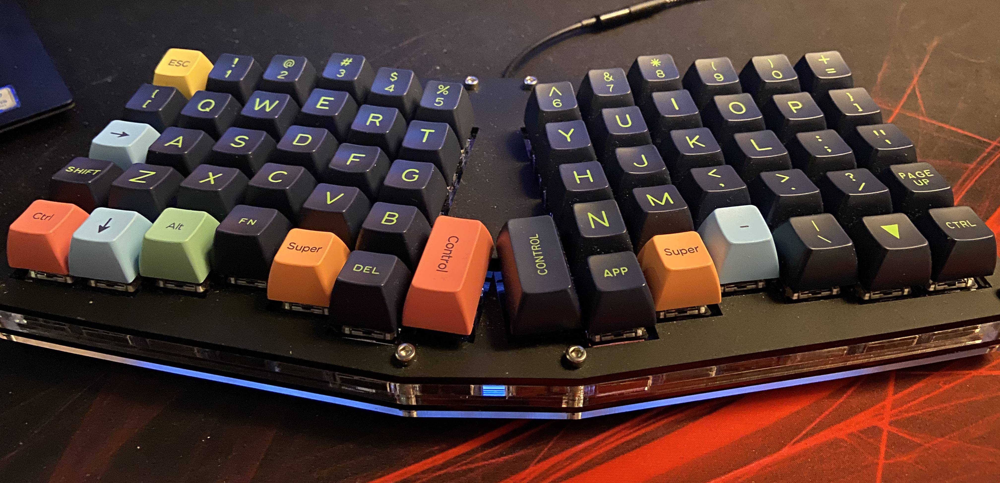

# qmk-atreus62
This is my custom firmware for my Atreus62 keyboard.

If you're interested in getting yourself an Atreus62 keyboards, it can be purchased from [Profet Keyboards](https://shop.profetkeyboards.com/product/atreus62-keyboard). It can be purchased pre-assembled or with parts so you can assamble it on your own.

## About

This is my custom layout which is based on the US keyboard layout with some extra modifications for the Swedish characters `åäö`. It consists of three layers where some special keys are accessible while holding the `FN` key. 

Input of Swedish characters under US layout is achieved with the usage of `compose` key. You can read more about this at the [Arch wiki](https://wiki.archlinux.org/title/Xorg/Keyboard_configuration#Configuring_compose_key).

## Installation

Installing this layout to your keyboard consists of two steps, compiling and flashing, but first you need to get the [QMK Firmware](https://github.com/qmk/qmk_firmware). It can easily be installed via the following command.

```
make qmk
```

### Compile

When you feel done with the layout, and all eventual changes are done etc, it's time to compile the firmware.

```
make compile
```

### Flash

When you have compiled your firmware it's time to flash it to your keyboard. I'ts important that you understand that this will override the current firmware on your keyboard, so if you have any changes that are not backed-up, they will be lost.

```
make flash
```

## Layout

The layout consists of three layers. The function layer is accesible while holding the `Fn` key.

### Layer: 0 (Normal)

The default layer, has most of the keys that you would want.

```
,-----------------------------------------.              ,-----------------------------------------.
| Esc  |   1  |   2  |   3  |   4  |   5  |              |   6  |   7  |   8  |   9  |   0  |   =  |
|------+------+------+------+------+------|              |------+------+------+------+------+------|
|  [   |   Q  |   W  |   E  |   R  |   T  |              |   Y  |   U  |   I  |   O  |   P  |   ]  |
|------+------+------+------+------+------|              |------+------+------+------+------+------|
| Tab  |   A  |   S  |   D  |   F  |   G  |              |   H  |   J  |   K  |   L  |   ;  |   '  |
|------+------+------+------+------+------|------.,------|------+------+------+------+------+------|
| Shft |   Z  |   X  |   C  |   V  |   B  | Del  ||Enter |   N  |   M  |   ,  |   .  |   /  | Shft |
|------+------+------+------+------+------|      ||      |------+------+------+------+------+------|
| Ctrl |      |  Alt |  Fn  |  OS  | BkSp |------'`------|  Spc |  OS  |   -  |   \  |   `  | Ctrl |
`-----------------------------------------'              `-----------------------------------------'
```

### Layer: 1 (Function)

The function layer, has some special keys but also the arrow keys. They follow the vim-keys. A reset layer is also accesible in this layer.

```
,-----------------------------------------.              ,-----------------------------------------.
|  F1  |  F2  |  F3  |  F4  |  F5  |  F6  |              |  F7  |  F8  |  F9  |  F10 |  F11 |  F12 |
|------+------+------+------+------+------|              |------+------+------+------+------+------|
|  Å   |      |      |   €  |      |      |              | Home | PgUp | PgDn |  End |      |      |
|------+------+------+------+------+------|              |------+------+------+------+------+------|
|      |      |      |      |      |      |              |   🠠  |   🠣  |   🠡  |   🠢  |   Ö  |   Ä  |
|------+------+------+------+------+------|------.,------|------+------+------+------+------+------|
|      |      |      |      |      |      |      ||      |      |      |      |      |      |      |
|------+------+------+------+------+------|      ||      |------+------+------+------+------+------|
|      |Layer2|      |      |      |      |------'`------|      |      |      |      |      |      |
`-----------------------------------------'              `-----------------------------------------'
```

### Layer: 2 (Reset)

The reset layer, only serves one function, reseting the keyboard so it can be flashed with new firmware. Don't press the reset button if you are not ready to flash new firmware, as this will "brick" your keyboard and make it unusable until you flash it.

```
,-----------------------------------------.              ,-----------------------------------------.
|Layer0|Layer0|Layer0|Layer0|Layer0|Layer0|              |Layer0|Layer0|Layer0|Layer0|Layer0|Layer0|
|------+------+------+------+------+------|              |------+------+------+------+------+------|
|Layer0|Layer0|Layer0|Layer0|Layer0|Layer0|              |Layer0|Layer0|Layer0|Layer0|Layer0|Layer0|
|------+------+------+------+------+------|              |------+------+------+------+------+------|
|Layer0|Layer0|Layer0|Layer0|Layer0|Layer0|              |Layer0|Layer0|Layer0|Layer0|Layer0|Layer0|
|------+------+------+------+------+------|------.,------|------+------+------+------+------+------|
|Layer0|Layer0|Layer0|Layer0|Layer0|Layer0| Reset||Reset |Layer0|Layer0|Layer0|Layer0|Layer0|Layer0|
|------+------+------+------+------+------|      ||      |------+------+------+------+------+------|
|Layer0|Layer0|Layer0|Layer0|Layer0|Layer0|------'`------|Layer0|Layer0|Layer0|Layer0|Layer0|Layer0|
`-----------------------------------------'              `-----------------------------------------'
```

## License

MIT Licence

Andreas Palm 2020
